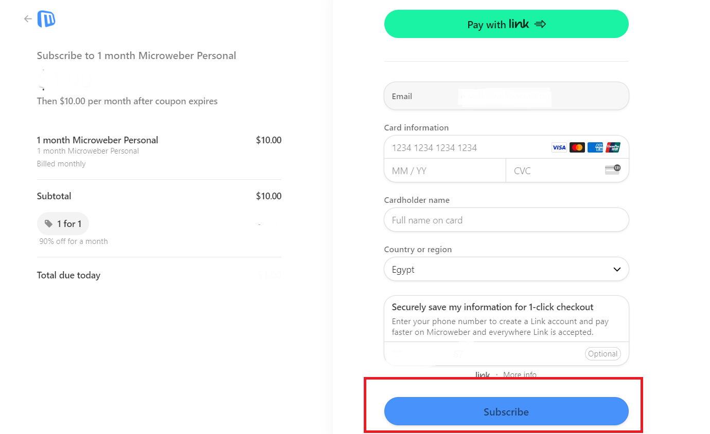

# Account Upgrade

In order to upgrade your account, follow the below steps:

1\)     Visit [https://microweber.com/](https://microweber.com/)

2\)     Select Log In.

<figure><figcaption></figcaption></figure>

3\)     Enter your account credentials.

<figure><figcaption></figcaption></figure>

4\)     After you Login, from your control panel Select “Upgrade”

<figure><figcaption></figcaption></figure>

&#x20; Note: This button disappears after you pay for your hosting plan and from Edit Website you will be able to access and edit the content of your site.

5\)     Then the below windows appear to sign up for the smallest hosting plan.

<figure><figcaption></figcaption></figure>

&#x20; Note: You can always choose your preferable plan by accessing [Microweber Subscription Plans](https://microweber.com/projects/plans?subscribe\_to\_plan\_id=22)

&#x20;

6\)     Press “Confirm” then you will be directed to subscription page.

7\)     Fill your data then press “Subscribe”.

<figure><figcaption></figcaption></figure>

After we receive the payment, we will enter your account to link the domain address to this site.
