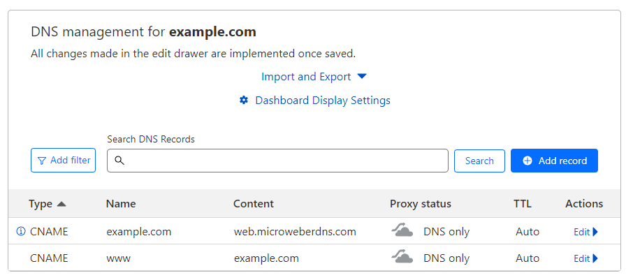

# How do I map my own domain to my website?

<figure><figcaption></figcaption></figure>

You need to change your DNS setting of your domain:

&#x20;

If your domain is subdomain of `microweber.net`, you must set  name `@` and value web`.microweberdns.com`

If your domain is subdomain of `microweber.page` , you must set  name `@` and value `pages.microweberdns.com`

After your domain is connected, you must check the SSL settings to fix the SSL certificate&#x20;

<figure><figcaption></figcaption></figure>

