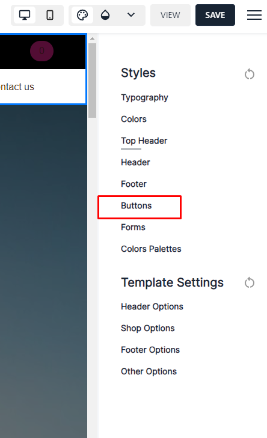

# Live edit- how to add pictures gallery

Reference to Live edit- How to edit your site

• A new window will open showing the layout of your newly made website, search for a layout or block and click on “**Insert module**”

<figure><figcaption></figcaption></figure>

• Then type “**Pictures Gallery**” in search bar.

<figure><figcaption></figcaption></figure>
