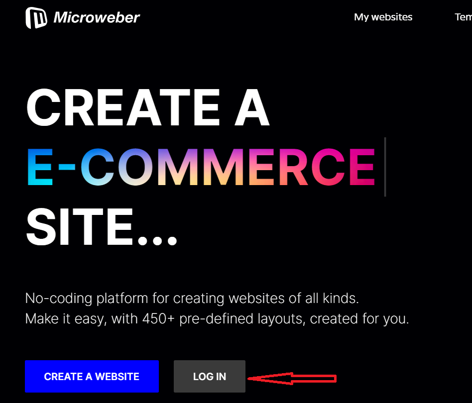

# Live edit - How to Edit you site

If you are new to our service, kindly follow the steps below:

1\)     Visit [https://microweber.com/](https://microweber.com/)

2\)     Select Log In.

3\)     Enter your account credentials.

<figure><figcaption></figcaption></figure>

<figure><figcaption></figcaption></figure>

4\)     After you create your website and naming it, click “**Edit website**”

<figure><figcaption></figcaption></figure>

&#x20; Note: if you already created your website, you can skip to step 4.

&#x20;&#x20;
