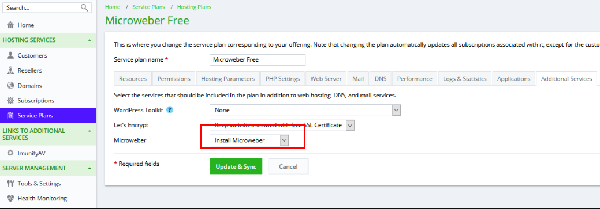

# Live edit - How to enter and exit preview mode

Reference to [How to edit your website](https://help.microweber.com/user-guide/live-edit-how-to-edit-you-site)

• A new window will open showing the layout of your newly made website, you can always choose the pages you want to search from the top page bar.

<figure><figcaption></figcaption></figure>

• Then from the bar at the top of the page search for “**View**”, now you can view the website page as you want.

<figure><figcaption></figcaption></figure>

• In order to leave the view mode, just click on the white shaded mark at the right top of page to go back to edit mode.

<figure><figcaption></figcaption></figure>

### Another way to enter view mode:

1. From the top bar choose “**Menu**”.

<figure><figcaption></figcaption></figure>

2. Choose “**See Website**”.

<figure><figcaption></figcaption></figure>

3. In order to go back to live edit, just click on “**Go Live Edit**”.

<figure><figcaption></figcaption></figure>
